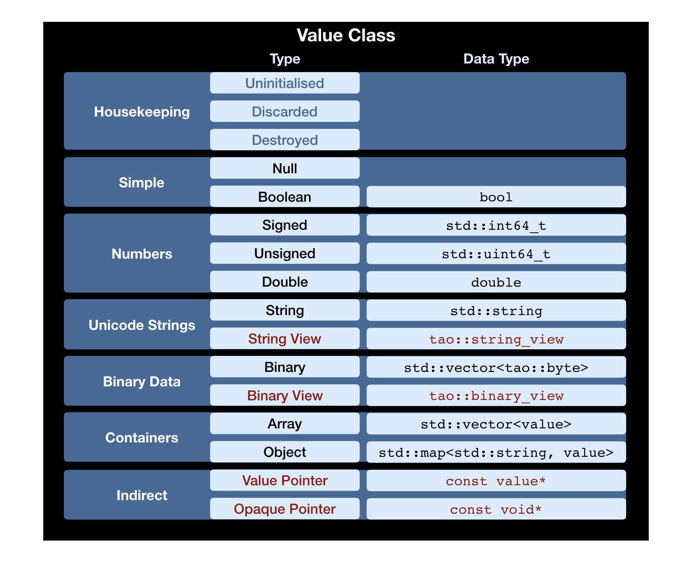

# Overview

The main parts of the JSON library are

* the [Value Class](Value-Class.md) to handle (extended) JSON data ([JAXN](https://github.com/stand-art/jaxn) data) in memory,
* the [Events Interface](Events-Interface.md) as universal adapter between different parts of the library (and other libraries), and
* the [Type Traits](Type-Traits.md) to control the interaction between C++ data types and the Value Class and Events Interface.

* The [Value Class](Value-Class.md) can be customised with [Type Traits](Type-Traits.md) and a [custom Base class](Advanced-Use-Cases.md#custom-base-class-for-values).
* The [Events Interface](Events-Interface.md) is used to convert the [Value Class](Value-Class.md) from and to external representations.
* One or more [Events Transformers](Events-Interface.md#included-transformers) can be used to modify, filter, ... Events and to send them to multiple Consumers.
* The [Type Traits](Type-Traits.md) are used to convert the [Value Class](Value-Class.md) from and to arbitrary C++ data types.
* The [Type Traits](Type-Traits.md) also generate Events, and thus external representations, directly from C++ data types, and
* are used to directly and efficiently parse external representations into arbitrary C++ data types.

* The [Value Class](Value-Class.md) can use views to strings and binary data to prevent memory allocations and copying.
* The [Value Class](Value-Class.md) can use pointers to other Value Class instances to re-use (parts of) other Values.
* The [Value Class](Value-Class.md) can use pointers to arbitrary objects (restricts the set of functions on the Value).

Copyright (c) 2018-2022 Dr. Colin Hirsch and Daniel Frey
